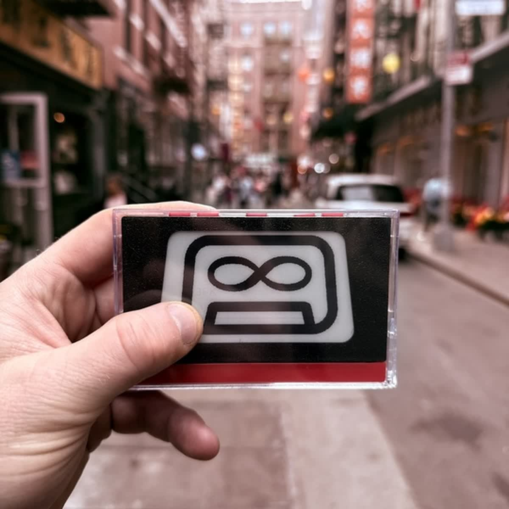
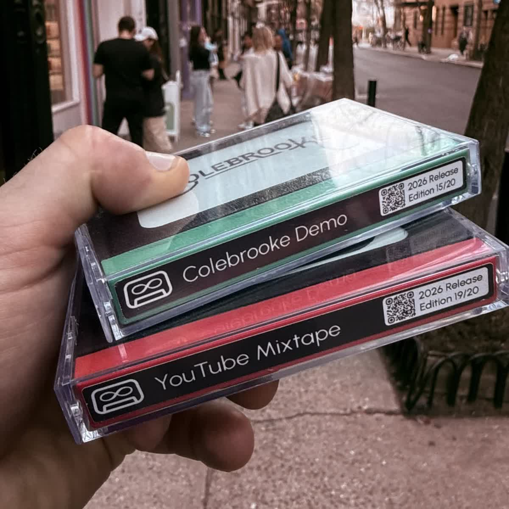
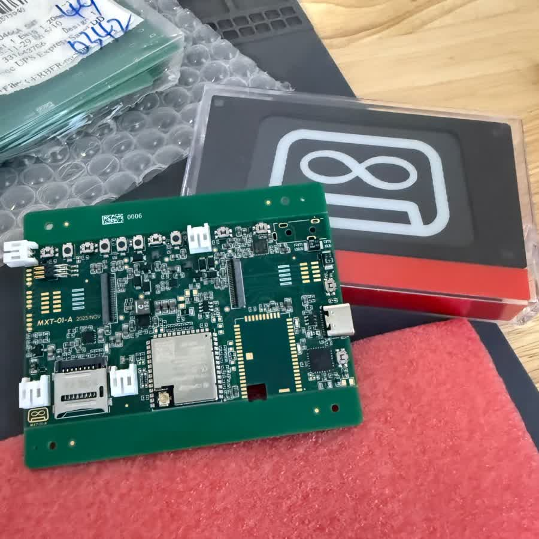
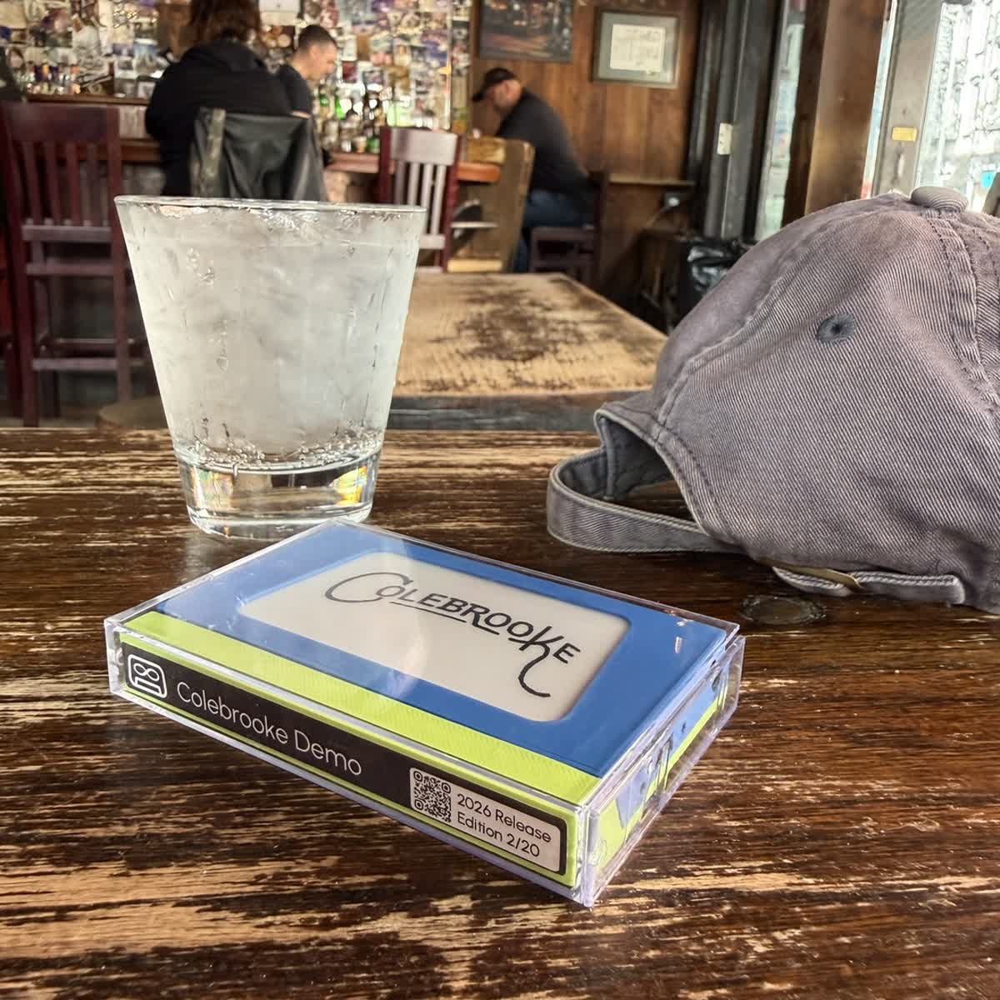

## Hi, I'm Patrick

I'm building **Mixfinity**, a physical-digital audio format for artists, collectors, and listeners.

[https://mixfinity.com](https://mixfinity.com)

[https://starsonder.com](https://starsonder.com)

<table width="720">
  <tr>
    <td width="50%">
      
    </td>
    <td width="50%">
      
    </td>
  </tr>
  <tr>
    <td width="50%">
      
    </td>
    <td width="50%">
      
    </td>
  </tr>
</table>

## What I'm working on

- E-Ink audio devices and physical-digital music formats
- Embedded firmware for audio, Bluetooth, and device UX
- Creator tools for releasing and fulfilling physical-digital music and podcasts
- Manufacturing, launch, and go-to-market systems

## Past projects

- **cfs-freertos**: [FreeRTOS port](https://github.com/pztrick/cfs-freertos) for NASA cFS / Core Flight System
- **Astrohaus Freewrite**: Kickstarted a [smart typewriter](https://getfreewrite.com) back in 2015

## Available for consulting

I can help with:

- Hardware product prototyping
- Circuit board bring-up
- FreeRTOS firmware
- Embedded Linux
- Web applications
- Developer tools

Reach out: `pz` at `pztrick.com`

## Elsewhere

- X.com: [@pztrick](https://x.com/pztrick)
- TikTok: [@pztrick](https://www.tiktok.com/@pztrick)
- Instagram: [@pztrick](https://www.instagram.com/pztrick)
- Website: [pztrick.com](https://pztrick.com)
